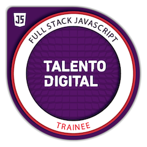
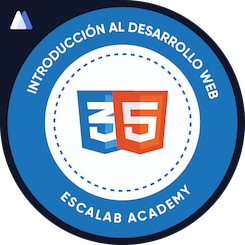

# Hola, mi nombre es *Darío Valenzuela*
### Bienvenido a mi github

 - Soy ingeniero de petróleo, emprendedor y ahora **desarrollador**
 - Finalizé con éxito el Bootcamp de Edutecno **Desarrollo de aplicaciones fullstack Javascript**
 - Chileno, venezolano, buen programador y buen lector
 - Metódico, organizado, autodidacta y siempre buscando respuestas creativas
 - Mi lengua materna es el **español**, I also speak **English** very well, *e parlo un po' de **italiano***

 

 

